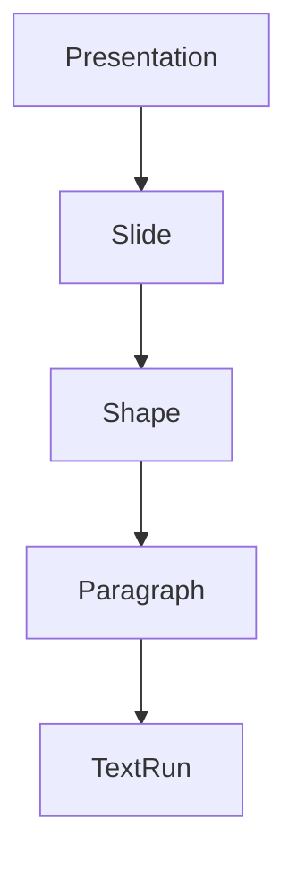

**!这个库是在[office-reader](https://github.com/huanhuan0812/office-reader)完成前的临时库，用于[ClassAssistant](https://github.com/huanhuan0812/ClassAssistant-cpp)整理课件时使用**

# pptx-reader

一个使用 C++ 编写的 PPTX 文本读取库。

- **libzip**：直接从 PPTX（zip）压缩包内读取 XML 文件，**不解压到磁盘**
- **PugiXML**：解析 OOXML 中的 `presentation.xml`、`slideN.xml` 等
- 提供 `Presentation` 类，支持**嵌套 for 循环**按顺序读取每一个文本框的文字

## 目录结构

```
include/pptx/
  pptx.hpp          # 统一入口头文件
  Presentation.hpp  # 演示文稿（入口）
  PptxArchive.hpp   # libzip 封装（zip 直接读取）
  Slide.hpp         # 幻灯片
  Shape.hpp         # 文本框 / 形状
  Paragraph.hpp     # 段落
  TextRun.hpp       # 文本片段（带格式）
src/                # 库实现
examples/           # 示例程序 read_pptx
tests/              # 测试 PPTX 生成脚本
pugixml/            # pugixml git 子模块
```

## 依赖

| 依赖 | 来源 | 说明 |
| ---- | ---- | ---- |
| libzip | `brew install libzip` | 读取 zip，CMake 通过 pkg-config 查找 |
| pugixml | git 子模块（`./pugixml`） | XML 解析 |

```bash
# 若子模块未初始化
git submodule update --init --recursive
```

## 构建

```bash
cmake -S . -B build
cmake --build build -j
```

构建产物：`build/libpptx_reader.a`（静态库）、`build/read_pptx`（示例程序）。

## 使用示例

```cpp
#include <pptx/pptx.hpp>
#include <iostream>

int main() {
    auto pres = pptx::Presentation::open("demo.pptx");

    for (const auto& slide : pres) {          // 遍历幻灯片
        for (const auto& shape : slide) {     // 遍历文本框
            if (!shape.hasText()) continue;
            for (const auto& para : shape) {  // 遍历段落
                std::cout << para.text() << '\n';
            }
        }
    }
}
```

每个层级都提供 `begin()/end()`（范围 for）以及 `text()` 便捷方法：

- `Presentation::slides()`、`Slide::shapes()`、`Shape::paragraphs()`、`Paragraph::runs()`
- `Slide::title()` —— 标题形状文本
- `Presentation::text()` —— 全部文本拼接

完整的类与函数说明、遍历顺序及更多示例见 **[api.md](api.md)**。

## 运行示例

```bash
python3 tests/make_test_pptx.py   # 生成测试文件 tests/data/sample.pptx
./build/read_pptx tests/data/sample.pptx
```

## 类层次



## 支持范围

- 文本读取：`<p:sp>`、`<p:cxnSp>`、`<p:pic>` 中的 `txBody`；表格（`graphicFrame`）单元格文本
- 组形状（`<p:grpSp>`）递归展开，保持文档顺序
- 段落属性：层级（`lvl`）、对齐（`algn`）
- 文本格式：加粗、斜体、下划线、字号（磅）、字体、颜色（RRGGBB）
- 换行 `<a:br/>`、XML 实体解码、`xml:space="preserve"` 空格保留、域 `<a:fld>`
- 文档核心属性：标题、作者、修改者、创建时间

## 许可证

见 [LICENSE](LICENSE)。
