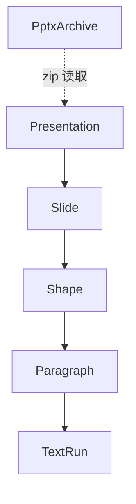

# pptx-reader API 参考

`pptx-reader` 是一个基于 **libzip + PugiXML** 的 PPTX 文本读取库：直接从压缩包内读取 XML，**不解压到磁盘**。

统一入口头文件：

```cpp
#include <pptx/pptx.hpp>
```

所有类位于命名空间 `pptx` 中。打开失败、条目缺失、XML 解析失败时抛出 `std::runtime_error`。

---

## 类层次总览



| 类 | 对应 OOXML | 说明 |
| ---- | ---- | ---- |
| `Presentation` | 整个 `.pptx` | 入口，按文档顺序持有全部幻灯片 |
| `Slide` | `ppt/slides/slideN.xml` | 一张幻灯片，按文档顺序持有形状 |
| `Shape` | `<p:sp>` 等 | 文本框 / 形状，按文档顺序持有段落 |
| `Paragraph` | `<a:p>` | 段落，按文档顺序持有文本片段 |
| `TextRun` | `<a:r>` | 一段文本及其格式 |
| `PptxArchive` | 底层 zip | libzip 封装，通常不需要直接使用 |

每一层都实现了 `begin()/end()`，因此可以**直接用嵌套范围 for 循环**遍历。

---

## Presentation（演示文稿）

### 打开文件

```cpp
static Presentation Presentation::open(const std::string& filePath);
```

解析整个演示文稿（幻灯片顺序取自 `presentation.xml` 的 `<p:sldIdLst>`）。

```cpp
auto pres = pptx::Presentation::open("demo.pptx");   // 失败抛出 std::runtime_error
```

### 成员函数

| 函数 | 返回类型 | 说明 |
| ---- | ---- | ---- |
| `slideCount()` | `int` | 幻灯片数量 |
| `slides()` | `std::vector<Slide>&`（及 const 版本） | 全部幻灯片，按演示顺序 |
| `documentTitle()` | `const std::string&` | 文档标题（`docProps/core.xml`） |
| `creator()` | `const std::string&` | 作者 |
| `lastModifiedBy()` | `const std::string&` | 最后修改者 |
| `created()` | `const std::string&` | 创建时间（W3CDTF 字符串） |
| `text()` | `std::string` | 全部幻灯片文本按顺序拼接 |
| `empty()` | `bool` | 是否没有任何幻灯片 |
| `begin() / end()` | 迭代器 | 支持范围 for 遍历 `Slide` |

---

## Slide（幻灯片）

| 函数 | 返回类型 | 说明 |
| ---- | ---- | ---- |
| `slideNumber()` | `int` | 页码，从 1 开始（按演示顺序，非文件名） |
| `shapes()` | `std::vector<Shape>&`（及 const 版本） | 本页全部形状，按文档顺序 |
| `title()` | `std::string` | 标题：第一个名称以 `Title`/`标题` 开头的形状文本；找不到返回空串 |
| `text()` | `std::string` | 本页全部含文本形状的文本拼接 |
| `empty()` | `bool` | 是否没有任何形状 |
| `begin() / end()` | 迭代器 | 支持范围 for 遍历 `Shape` |

---

## Shape（文本框 / 形状）

对应 `<p:sp>`（文本框）、`<p:cxnSp>`（连接符）、`<p:pic>`（图片）、`<p:graphicFrame>`（表格）等。组形状 `<p:grpSp>` 会被**递归展开平铺**到 `shapes()` 中，保持文档顺序。

| 函数 | 返回类型 | 说明 |
| ---- | ---- | ---- |
| `id()` | `int` | 形状 id（`<p:cNvPr id="..."/>`） |
| `name()` | `const std::string&` | 形状名称（如 `"Title 1"`、`"TextBox 5"`） |
| `type()` | `const std::string&` | 类型：`"sp"` / `"cxnSp"` / `"pic"` / `"grpSp"` / `"graphicFrame"` |
| `paragraphs()` | `std::vector<Paragraph>&`（及 const 版本） | 本形状的段落 |
| `hasText()` | `bool` | 是否包含文本（至少一个段落） |
| `text()` | `std::string` | 本形状全文，段落间用 `\n` 分隔 |
| `empty()` | `bool` | 是否没有任何段落 |
| `begin() / end()` | 迭代器 | 支持范围 for 遍历 `Paragraph` |

> 表格（`graphicFrame`）：单元格文本按**行优先**顺序读出，追加到该形状的 `paragraphs()` 中。

---

## Paragraph（段落）

对应 `<a:p>`。

| 函数 | 返回类型 | 说明 |
| ---- | ---- | ---- |
| `level()` | `int` | 缩进层级（`<a:pPr lvl="..."/>`，从 0 开始） |
| `alignment()` | `const std::string&` | 对齐方式原始值：`l` / `ctr` / `r` / `just` / `dist` |
| `runs()` | `std::vector<TextRun>&`（及 const 版本） | 本段落的文本片段 |
| `text()` | `std::string` | 段落全文（各 run 按序拼接，`<a:br/>` 变成 `\n`） |
| `empty()` | `bool` | 是否没有任何文本片段 |
| `begin() / end()` | 迭代器 | 支持范围 for 遍历 `TextRun` |

---

## TextRun（文本片段）

对应 `<a:r>`，携带该片段的格式信息。

| 函数 | 返回类型 | 说明 |
| ---- | ---- | ---- |
| `text()` | `const std::string&` | 片段文本 |
| `bold()` | `bool` | 是否加粗 |
| `italic()` | `bool` | 是否斜体 |
| `underline()` | `bool` | 是否下划线 |
| `fontSize()` | `double` | 字号，单位：磅（pt） |
| `fontName()` | `const std::string&` | 西文字体名称 |
| `color()` | `const std::string&` | 颜色 `"RRGGBB"` 十六进制；未设置为空串 |
| `empty()` | `bool` | 是否为空文本 |

---

## PptxArchive（底层，一般不需要使用）

libzip 的 RAII 封装，负责直接读取 zip 内条目。

```cpp
PptxArchive archive("demo.pptx");
bool           has  = archive.hasEntry("ppt/presentation.xml");  // 是否存在条目
std::string    xml  = archive.readEntry("ppt/presentation.xml"); // 读取原始内容
```

| 函数 | 返回类型 | 说明 |
| ---- | ---- | ---- |
| `hasEntry(path)` | `bool` | 压缩包内是否存在该路径 |
| `readEntry(path)` | `std::string` | 读取条目原始内容，缺失/失败抛 `std::runtime_error` |
| `filePath()` | `const std::string&` | 打开的文件路径 |

不可拷贝，可移动。

---

## 用法示例

### 1. 嵌套 for 循环读取每个文本框的文字（核心用法）

```cpp
#include <pptx/pptx.hpp>
#include <iostream>

int main() {
    auto pres = pptx::Presentation::open("demo.pptx");

    for (const auto& slide : pres) {            // 遍历幻灯片
        for (const auto& shape : slide) {       // 遍历文本框
            if (!shape.hasText()) continue;
            for (const auto& para : shape) {    // 遍历段落
                std::cout << para.text() << '\n';
            }
        }
    }
}
```

### 2. 逐级读取到 TextRun，同时获取格式信息

```cpp
for (const auto& slide : pres.slides()) {
    for (const auto& shape : slide.shapes()) {
        for (const auto& para : shape.paragraphs()) {
            std::cout << "[lvl=" << para.level() << "]\n";
            for (const auto& run : para.runs()) {
                std::cout << "  " << run.text()
                          << " (bold=" << run.bold()
                          << ", size=" << run.fontSize() << "pt"
                          << ", color=" << run.color() << ")\n";
            }
        }
    }
}
```

### 3. 使用访问器方法（等价写法）

```cpp
for (const auto& slide : pres.slides())
    for (const auto& shape : slide.shapes())
        for (const auto& para : shape.paragraphs())
            std::cout << para.text() << '\n';
```

### 4. 提取标题和整篇纯文本

```cpp
std::cout << "文档标题: " << pres.documentTitle() << "\n";
std::cout << "作者: "     << pres.creator() << "\n";

for (const auto& slide : pres) {
    std::cout << "第 " << slide.slideNumber() << " 页标题: " << slide.title() << "\n";
}

// 整篇纯文本（所有幻灯片按顺序拼接）
std::cout << pres.text() << "\n";
```

### 5. 错误处理

```cpp
#include <exception>
#include <iostream>

int main(int argc, char** argv) {
    try {
        auto pres = pptx::Presentation::open(argv[1]);
        // ...
    } catch (const std::exception& e) {
        std::cerr << "读取失败: " << e.what() << "\n";
        return 1;
    }
    return 0;
}
```

---

## 遍历顺序

- 幻灯片顺序：`presentation.xml` 中 `<p:sldIdLst>` 的声明顺序（即演示时的实际顺序），与文件名 `slideN.xml` 无关。
- 形状顺序：`spTree` 中的文档顺序；组形状内的形状会被平铺到外层，位置在组形状处。
- 段落 / 文本片段：XML 中的文档顺序。

## 注意事项

- `text()` 是**拼接视图**，不保留段落/形状之间的结构边界；需要结构时请用 `paragraphs()` / `shapes()` 逐级遍历。
- 行内换行 `<a:br/>` 在段落文本中以 `\n` 呈现。
- XML 实体（`&amp;`、`&lt;` 等）会被自动解码为原始字符。
- 仅读取 `slides` 中的文本；母版、版式、备注页的文本不包含在内。
- 若 `presentation.xml` 缺少 `<p:sldIdLst>`，会退化为按关系表顺序读取幻灯片。
